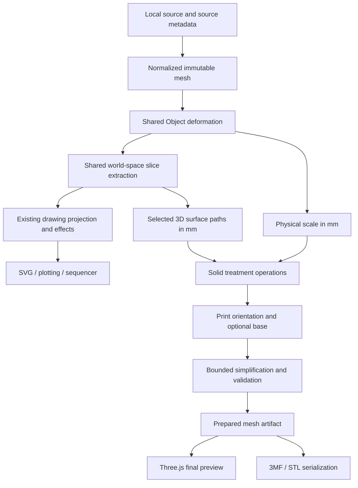

# 3D mode: slice-driven objects for printing

Status: implementation started, 8 September 2026. The Phase-0 kernel spike now includes triangle-derived planar contours and circular capsule sweeps; the feasibility gate remains open. See [feasibility progress and measurements](./THREE_D_FEASIBILITY.md). The production application does not yet expose 3D mode. The remaining sections describe the intended implementation.

Add **3D** beside Config, Animation, and Sequencer. The mode presents the shaped source in a polished Three.js scene, turns selected contours into physical surface features, and exports the resulting solid at an explicit size in millimeters.

The first public release should deliver **Inset grooves**, **Embossed ribs**, a useful studio viewport, and validated **3MF / binary STL** export. Filament printing is the provisional first target; resin-specific preparation comes later. Slicewise remains local to the browser.

## 1. Product experience

The core workflow is:

1. Load or generate a shape and use the existing Object controls.
2. Enter 3D, choose the object's physical size, and inspect it in the scene.
3. Choose a slice field and select which slices receive a treatment.
4. Adjust groove depth or rib height, width, and profile.
5. Inspect the finished geometry, orient it for printing, and review highlighted issues.
6. Export the prepared object to a printer slicer.

Example: a 100 mm tall twisted object with 24 height contours receives 1.2 mm wide, 0.6 mm deep rounded grooves. Switching to Emboss produces raised bands following the same contours. Choosing every second slice changes the pattern without reshaping the underlying source.

Here, a **design slice** defines a creative feature. A printer's **layer height** describes how its slicer manufactures that object. These are separate controls and must remain clearly named.

### Workspace layout

Retain the existing rail and introduce mode-specific sections:

| Area              | Contents                                                                     |
| ----------------- | ---------------------------------------------------------------------------- |
| Source and Object | Existing source selection and deformation controls                           |
| Slices            | Compatible field, orientation, count, spacing, and selected slice range      |
| Surface           | Inset / Emboss, profile, width, depth / height, pattern selection            |
| Scene             | Material, background, lighting, contour overlay, reference views             |
| Print             | Millimeter dimensions, build volume, orientation, optional base, diagnostics |
| Export            | Format, detail tolerance, preparation status, file size, download            |

Use a large viewport with a compact toolbar: **Studio / Inspect / Print**, Fit, front/side/top/isometric views, and perspective/orthographic. A small bottom status area reports dimensions, triangles, connected bodies, and current preparation state. Selecting a diagnostic highlights its location and offers the relevant adjustment.

Studio uses soft shadows and a matte material. Inspect exposes wireframe, source/result comparison, slice overlays, and a movable section plane. Print shows the build plate, physical dimensions, and diagnostic overlays. Section clipping and exploded inspection are explicitly display operations; an actual cut or separated export requires a modeling operation.

Existing drawing-only controls disappear from the 3D rail while retaining their state. Keep their DOM bindings mounted where required by the current runtime. Shared controls must have one instance and one ID. Route the main Export action and shortcuts according to the active mode; remove the SVG clipboard action from the 3D workspace.

### State ownership and mode transitions

Use the existing source and current Config Object/Slices values as the shared design inputs. Editing those shared controls in 3D also updates their Config values. Surface treatments, physical sizing, print preparation, and scene settings belong to a separate 3D project; they do not alter the source mesh or add effects to the drawing pipeline.

Maintain an independent inspection camera. Orbiting in 3D must never change printable geometry. When importing a camera-relative **View depth** field, capture its current direction as a fixed model-space cutting direction. Provide an explicit **Align slices to view** action to change that direction.

Entering 3D stops Animation/Sequencer transport through their normal exit paths. Animation must first restore its frozen Config settings. The initial scope uses one Config shape; an X/Y Morph grid is not implicitly combined into a solid. A later **Use this variation/frame** action can capture a single evaluated parameter snapshot.

In 3D, Undo/Redo traverses a mode-scoped history of both shared design edits and 3D edits. Leaving commits the final shared settings as one Config history transaction. Source replacement remains outside parameter undo, consistent with the current app. It invalidates geometry and preflight, resets slice selection, and requests a new size choice for the new source. Remember the previous 3D project's settings for that source during the session.

## 2. Creative treatments

### First release

| Treatment | Physical result                                       | Controls and constraints                                                                        |
| --------- | ----------------------------------------------------- | ----------------------------------------------------------------------------------------------- |
| Inset     | A recessed channel centered on each selected contour  | Width across the surface, inward depth, rounded or V profile; flag thin walls and breakthroughs |
| Emboss    | A rib fused to the source along each selected contour | Width, outward height, rounded or flat profile; ensure positive overlap with the base solid     |

“Inset” means engraving a groove in this release. Recessing the entire region between two slices is a separate future **Recess bands** treatment.

Start with one active treatment, plus:

- All slices, a contiguous range, or every Nth slice with an offset.
- Rounded profiles first; V grooves and flat ribs after the profile kernel passes the same tests.
- Width and depth/height in millimeters, independent from SVG stroke width.
- Live slice highlighting and a small cross-section illustration of the chosen profile.
- A bypass switch for comparing source and result.

Depth and height measure maximum penetration/protrusion relative to the supported local surface. At sharp corners or high curvature, the profile construction must either meet its dimensional tolerance or identify the affected region as unsupported. Avoid presenting nominal dimensions as guaranteed measurements on arbitrary surfaces.

Select patterns by ordered slice index, not by individual loop: one level may produce several disconnected contours. Recompute selection deterministically when count changes, clamp explicit ranges, and tell the user when the selected range becomes empty. Pattern offsets wrap by N. The same inputs always select the same slices.

### Proposed starting values

These are product defaults for exploration, not universal printing limits. Confirm them with the first printed samples.

| Setting                                      | Proposed default         | Behavior                                                                   |
| -------------------------------------------- | ------------------------ | -------------------------------------------------------------------------- |
| Physical size for unitless generated sources | Longest dimension 100 mm | Imported raw coordinates offer an explicit unit choice                     |
| Treatment                                    | Off                      | Entering 3D preserves the shape                                            |
| Slice count                                  | Current Config value     | Quick previews retain the full selected slice set                          |
| Pattern                                      | All                      | Every N: 1–32; offset: 0–N−1                                               |
| Profile                                      | Rounded                  | Other profiles appear when supported                                       |
| Width                                        | 1.2 mm                   | Initial editing range 0.2–20 mm; constrained by model and geometry budgets |
| Inset depth                                  | 0.6 mm                   | 0–10 mm; zero is exactly neutral                                           |
| Emboss height                                | 0.8 mm                   | 0–10 mm; zero is exactly neutral                                           |
| FDM reference nozzle / layer height          | 0.4 / 0.2 mm             | Editable diagnostic assumptions, not machine commands                      |
| Minimum wall target                          | 1.2 mm                   | User-adjustable warning threshold                                          |
| Final surface tolerance                      | 0.05 mm                  | Candidate range 0.01–0.2 mm, subject to benchmark limits                   |
| Material                                     | Warm matte clay          | Presentation only                                                          |

Initially omit randomized print settings. Creative preset/randomize actions may change only bounded treatment parameters; dimensions, orientation, and diagnostic thresholds stay explicit.

### Subsequent releases

| Feature                  | Creative use                                     | Additional work required                                                          |
| ------------------------ | ------------------------------------------------ | --------------------------------------------------------------------------------- |
| Alternating treatments   | Alternate raised and recessed rings              | Ordered effect composition and collision rules                                    |
| Recess bands / terraces  | Stepped sculpture from regions between slices    | Solid slab intersections, lateral offsets, hole preservation, and joining         |
| Inlays                   | Colored or removable inserts fitted into grooves | Separate pocket/insert solids, measured clearance, part identity, assembly export |
| Slice lattice            | Ribs form an open structural object              | Network connectivity, bridges, minimum strut size, support assessment             |
| Stacked slices           | Separate printable slabs or a joined stack       | Caps, alignment pins, clearance, part labels, plate layout                        |
| Continuous spiral ribs   | A continuous ridge winds around the object       | Reliable 3D spiral paths and seam behavior                                        |
| SVG surface engraving    | Artwork defines channels over the object         | Robust surface paths, branches, intersections, and endpoint caps                  |
| Crossed patterns / weave | Two families intersect over a surface            | Junction solids and intentional over/under topology                               |

Do not include arbitrary CAD editing, printer G-code generation, supports, infill generation, or printer control in the first release. The existing three-axis G-code modules are for plotting and do not form a filament printing pipeline.

## 3. Existing foundations and gaps

The implementation should reuse the maintained application under `src/`.

| Existing module         | Reuse                                                            | Required addition                                                               |
| ----------------------- | ---------------------------------------------------------------- | ------------------------------------------------------------------------------- |
| `mesh.ts`               | STL/OBJ/PLY parsing and normalization                            | Preserve raw bounds, normalization transform, and unit provenance               |
| `mesh-deformation.ts`   | Immutable, deterministic Object transforms                       | Shared access from the 3D worker; final-tolerance refinement policy             |
| `scalar-fields.ts`      | Planar, analytic, geodesic, and curvature fields                 | Serializable field specification and explicit capability checks                 |
| `contour-engine.ts`     | Model-space intersections, slice ordering, chaining              | Extract the world-space stage before projection and decoration                  |
| `mesh-topology.ts`      | Edge incidence, boundaries, components                           | Vertex manifold checks, winding, intersections, and solid validity              |
| `generativeMesh.ts`     | Procedural mesh sources                                          | Validate every result; narrow tunnels can produce non-manifold edges            |
| `generative-terrain.ts` | Height-field surface                                             | Optional printable side walls and bottom; current terrain is intentionally open |
| `svg-mesh.ts`           | Filled SVG extrusion and Three.js dependency                     | Solid validation for compound shapes and bevels                                 |
| `parameter-history.ts`  | Bounded history and detached snapshots                           | Versioned 3D project and mode-specific restoration                              |
| `slicer.ts`             | Runtime settings, source lifecycle, worker scheduling, downloads | 3D orchestration and event routing                                              |

Three.js is already installed and used for SVG extrusion, but there is no scene viewport or solid-model export pipeline. Cached contour slices already contain world points and polylines, which is a useful extraction boundary. The current exported toolpaths and sequencer features are projected data and must not become the manufacturing input.

Normalization currently centers and scales meshes without returning the transform. Raw coordinate extent is therefore not recoverable from the normalized mesh alone. Preserve this metadata at import while maintaining existing normalized coordinates for the drawing pipeline.

Existing contour refinement can reconstruct smoother curves from vertex normals beyond the authored triangles. Printable treatments must follow the actual manufacturing surface: use triangle intersections, or explicitly refine the base surface and derive its contours together. A visually smoothed line floating above an unchanged mesh cannot define a reliable groove.

## 4. Geometry architecture

### Units and transform order

Retain source center, normalization scale, original bounds, declared/assumed units, and up-axis correction. STL/OBJ/PLY input should use an explicit unit selector where the parser cannot establish units. Generated and SVG-derived shapes start with a chosen physical dimension; no size is inferred from the drawing's artboard.

Use this order: source up-axis correction → existing Object deformation → uniform physical scale → slice treatments → print orientation → optional print base/bed placement. Apply surface paths through exactly the same transforms as the base geometry.

Sizing uses the deformed base's bounds; also show final bounds including ribs and base. Changing physical size recalculates the base at the new scale while treatment widths/depths remain millimeter values. Do not automatically fit the treated result back into the requested base size. Treat whole-result scaling as a separate future operation.

Keep Z-up throughout geometry, scene setup, and export. Camera and display offsets never enter the manufacturing transform. Validate axis conversion with an asymmetric fixture of known dimensions.

### Shared model-space contract

Extract a pure `slice-geometry.ts` stage incrementally, with existing drawing integration tests guarding output. Its output should retain:

- Mesh identity/revision and resolved field identity.
- Stable slice index, field level, normalized position, and disconnected run boundaries.
- XYZ points, closure flags, and source triangle/barycentric ownership where needed.
- Geometric surface normals, field direction where defined, and diagnostics.
- Explicit extraction tolerance and indication of any budget truncation.

Use typed arrays and offsets across workers. Reconstruct evaluators inside the worker from a serializable field specification; functions and WeakMap identities cannot cross the worker boundary. Meshes and paths come from one immutable design snapshot.

Never hide back-facing contours, clip to the artboard, apply projection warps, or use decorative rays and line effects in this stage. A budget-truncated extraction is unsuitable for final export.

### Preferred solid kernel and initial algorithm

Evaluate **Manifold WASM** as the first candidate for solid union/difference, isolated behind `solid-kernel.ts`. Its documented mesh Boolean operations require manifold inputs, and import can return errors; it is not a general repair service. Release WASM allocations explicitly. The dependency decision remains gated by our own fixture and browser benchmarks. [Manifold documentation](https://manifoldcad.org/docs/html/), [WASM API](https://manifoldcad.org/docs/jsapi/classes/manifold.Manifold.html).

For the first supported planar contours:

1. Validate the deformed source as a solid.
2. Extract and resample the selected surface paths to a physical chord tolerance.
3. Construct closed cutter/rib volumes using a stable tangent/surface-normal frame and the chosen cross-section.
4. Give ribs intentional positive overlap with the source; avoid merely touching surfaces. Add cutter penetration appropriate to the requested groove profile.
5. Union overlapping treatment volumes in bounded batches, then subtract cutters or union ribs with the source.
6. Remove temporary geometry and validate the resulting solid.

Profile sweeps need explicit end caps, deterministic closed-loop seam handling, bounded corner joins, and detection of sharp normal changes. A general swept surface can self-intersect: each tool must pass validity checks before Boolean evaluation. Prototype segment solids with bounded joins/unions for difficult corners; reject unsupported spans if this cannot meet tolerance. Do not bridge nearby but unrelated folds just because their paths are close in XYZ.

Merge overlapping grooves by a defined Boolean union. Mark any removed-through wall or detached body in diagnostics. Do not silently reduce depth, delete islands, or fill intentional holes to obtain a passing result. Zero treatment amount returns the untouched base geometry and bypasses Booleans.

If benchmarks show unacceptable performance or robustness, stop at the kernel decision gate. Compare a bounded SDF/remeshing implementation on the same fixtures before choosing it. That path needs explicit resolution, thin-feature loss measurements, and a memory budget; it must never activate silently as a repair fallback.

### Field support rollout

| Field/source feature                      | Initial behavior                                                | Later gate                                                             |
| ----------------------------------------- | --------------------------------------------------------------- | ---------------------------------------------------------------------- |
| Height, width, depth, custom planar angle | Supported treatments                                            | Core release fixtures                                                  |
| View depth                                | Freeze as a model-space direction                               | Camera motion must remain geometry-neutral                             |
| Divergent planes                          | Initially unavailable for treatments                            | Per-plane framing and intersecting pattern tests                       |
| Spherical / cylindrical fields            | Follow-up release                                               | Curved paths, poles, self-collision, and width tests                   |
| LFO-modulated fields                      | Follow-up release                                               | Non-planar sweeps and high-frequency budgets                           |
| Geodesic / curvature / Voronoi            | Follow-up release                                               | Surface-only values, singularities, branches, and disconnected regions |
| SVG cutting paths                         | Follow-up release                                               | Open paths and cap/junction validation                                 |
| Spiral / weave / explosion                | Retain Config settings; unavailable as initial solid treatments | Dedicated solid construction                                           |
| SVG centerlines / hyperbolic line art     | Explain that a surface or extrusion is needed                   | Optional explicit thickening later                                     |
| Terrain                                   | Viewable; printing requires adding a base                       | Specialized terrain closure                                            |

A field's scalar values are not necessarily distances in millimeters. In particular, curvature and surface geodesic fields must not be treated as an ambient signed-distance function. Future consistent-width bands require surface-aware construction and measurement. Never silently switch an unsupported field to Height; offer an explicit compatible choice.

## 5. Three.js scene

Use a small imperative Three.js adapter mounted by a React viewport component. This matches the current runtime ownership and avoids requiring an additional React scene framework. Keep application scheduling and downloads in `slicer.ts`; the adapter owns only renderer, scene, controls, and GPU resource lifecycle.

Use a Z-up camera, OrbitControls, a studio floor, soft directional shadows, and physically based materials. A locally generated RoomEnvironment/PMREM can supply environment lighting without downloading an HDR asset. [OrbitControls](https://threejs.org/docs/pages/OrbitControls.html), [RoomEnvironment](https://threejs.org/docs/pages/RoomEnvironment.html).

Offer a compact selection of clay, porcelain, resin-like, and metal presentation presets. Make clear that appearance materials do not select physical printing material. Slice colors can aid inspection without claiming multi-material export.

Keep the authoritative mesh separate from render buffers that duplicate vertices for hard edges or add smooth normals. Correct rendering normals improve presentation; they cannot repair a mesh. Export only the prepared manufacturing artifact, excluding lights, floor, overlays, and display meshes.

Render on demand, with temporary animation while orbit damping settles. Cap pixel ratio and reduce shadows on slower devices. Pause rendering in hidden tabs and outside 3D mode. Dispose replaced geometries, materials, controls, render targets, and environment textures; test repeated mode switching and WebGL context loss. A renderer failure should preserve project state and any completed export artifact.

Provide keyboard-operable camera presets, focus-visible controls, textual diagnostic counts, and reduced-motion behavior. Diagnostic overlays need labels or patterns as well as color. On narrow screens, use a viewport plus collapsible control drawer.

## 6. Print preparation and export

### Geometry checks versus manufacturing advice

Validate source input, treatment tools, and final output. Reuse topology analysis, then add finite coordinate/index checks, zero-area and duplicate faces, coherent winding, vertex-link manifoldness, boundary detection, shell containment/orientation, and non-adjacent triangle intersections. Positive total signed volume and two faces per edge alone are insufficient.

Report three states:

- **Geometry valid:** completed solid checks pass for this exact artifact.
- **Review for printing:** geometry is valid but feature size, orientation, overhangs, disconnected bodies, or build volume need attention.
- **Cannot prepare:** a concrete geometry error or complexity limit prevents valid solid output.

Thickness analysis should begin as bounded surface sampling/ray tests, including treated regions. Report measured minima, sampling coverage, and unresolved regions; these are estimates, not proof of structural strength. If no dependable sample can be obtained, say the check is unavailable. Nozzle/layer comparisons are advisories based on user-specified assumptions.

Show configurable overhang highlighting relative to the bed, approximate contact area, body count, final bounds, and build-volume fit. Declare the angle convention in the UI. Print orientation offers manual rotation, cardinal presets, **Lay selected face flat**, and **Drop to bed**. Later auto-orientation can rank a bounded set of candidates by contact, height, and estimated overhang area without promising optimal support use.

Default to a solid envelope and let printer slicers generate shells/infill. Defer hollowing, drainage holes, trapped-resin checks, and resin support tooling until that workflow is designed and tested.

### Optional constructive fixes

Safe cleanup may remove unused vertices and strictly degenerate faces, or weld equivalent coordinates within a declared tolerance, followed by full revalidation. Display what changed. Winding correction must respect nested cavity shells; do not turn every closed shell independently outward.

User-visible operations can add a plinth or close dedicated terrain with side walls and a bottom. Derive terrain boundaries from the actual current surface and ensure the bottom lies below its lowest point. Check that a base truly intersects the object and does not merely touch or create disconnected geometry. Arbitrary imported open meshes need a specific repair strategy and stay blocked from print export until valid.

Simplify only within an explicit surface-deviation tolerance while preserving topology and treatment detail. Verify the simplified result against the unsimplified surface and revalidate afterward. If it fails, retain the unsimplified valid mesh and explain why file reduction was skipped. A triangle-count target is secondary to dimensional fidelity.

### Export formats

| Format         | Purpose                                                                           | Release                                             |
| -------------- | --------------------------------------------------------------------------------- | --------------------------------------------------- |
| 3MF            | Preferred printing exchange, explicit mm units, named bodies and build transforms | First public release                                |
| Binary STL     | Broad geometry compatibility, coordinates emitted in mm with a visible unit note  | First public release                                |
| GLB            | Sharing appearance and viewing in other applications                              | Later convenience export                            |
| Native project | Editable source association, parameters, and reproducibility metadata             | Local persistence initially; portable package later |

3MF is a ZIP/XML package; implement a focused Core writer with tests for package relationships, indexed mesh resources, units, and build entries. Use a bounded ZIP dependency selected during the export phase. Installed Three.js addons include STL export but no 3MF writer, so budget this as separate work. The Core format defines units and mesh requirements; writing a `.3mf` extension does not validate our geometry. [3MF Core specification](https://github.com/3MFConsortium/spec_core/blob/master/3MF%20Core%20Specification.md).

STL stores geometry without unit metadata or material appearance. Use a pure typed-array binary serializer, or wrap and test the Three.js exporter against the same prepared artifact. Reimport must check dimensions and geometry. [Three.js STLExporter documentation](https://threejs.org/docs/pages/STLExporter.html).

Export captures an immutable design revision, computes final detail, validates, and presents that exact prepared mesh for inspection. If the design changes, label the artifact stale and require preparation of the new revision before its export. An immediate download can reuse an already inspected, current artifact. Warnings remain visible; invalid geometry never receives a successful print-readiness label.

Multiple valid bodies are intentional only when clearly shown. Initial 3MF may retain them as named objects at their authored placements; this is not automatic print-bed packing. For STL, offer separate named files for multiple bodies, or an explicit combined file. A standard geometry 3MF must not pretend to contain a printer vendor's project settings. Supports and final manufacturing toolpaths remain with the external slicer.

## 7. Modules, workers, and persistence

Suggested boundaries; keep files focused and adjust names during implementation:

| Module                                              | Responsibility                                                            |
| --------------------------------------------------- | ------------------------------------------------------------------------- |
| `source-metadata.ts`                                | Source dimensions, normalization transform, units, source identity        |
| `slice-geometry.ts`                                 | Shared model-space contour extraction and ownership                       |
| `three-d-project.ts`                                | Versioned settings, immutable edits, capability rules, migrations         |
| `three-d-storage.ts`                                | IndexedDB persistence and source association                              |
| `slice-treatment.ts`                                | Profile geometry, selected paths, operation recipe                        |
| `solid-kernel.ts`                                   | WASM initialization, typed-array adapters, bounded operations and cleanup |
| `print-preparation.ts`                              | Physical transforms, bases, simplification coordination                   |
| `print-validation.ts`                               | Solid checks and bounded manufacturing diagnostics                        |
| `three-d-worker.ts`                                 | Source installation, preview/prepare jobs, progress and errors            |
| `three-d-export.ts`, `three-mf.ts`, `stl-export.ts` | Artifact assembly and DOM-free serialization                              |
| `three-d-scene.ts`                                  | Browser-only renderer and interaction lifecycle                           |
| `components/three-d/*`                              | Viewport, treatment controls, print/export presentation                   |

The project stores a version, source fingerprint, shared design snapshot, physical size, treatment settings, frozen cutting frame, print setup, and scene settings. Store kernel/recipe versions and tolerance with prepared-artifact metadata so later algorithm changes cannot reuse stale results. Derived geometry does not belong in undo history.

Local settings autosave should follow existing source-excluding persistence conventions. Retain procedural source recipes where practical; for uploads, store a local hash/fingerprint and request the same source on restore. A mismatched source must not silently acquire a previous model's millimeter settings. Saving uploaded bytes in a portable/native project is a later explicit save operation.

Add typed `threedcommand`, `threedstatechange`, and `threedstaterequest` events. Refactor the mode switch toward a shared WorkspaceMode type, preserving `animationmodechange` as a compatibility adapter and updating all producers/consumers together. Do not append Three.js state or print settings to the exhaustive drawing `ContourSettings` adapter.

### Scheduling and budgets

- Lazy-load the scene and kernel on entry or first required operation; bundle WASM/assets for local operation.
- Give each job a request ID, source version, project revision, purpose, and tolerance.
- Maintain one active 3D geometry job plus the latest queued request. Ignore stale results.
- Transfer detached copies of owned typed-array buffers; never detach the shared source or currently displayed artifact accidentally.
- During slider drags, reduce tessellation precision while preserving selected slices. A temporary approximate preview is visibly marked; only completed preparation becomes exportable.
- Keep the last valid result visible during work, with Pending/Failed status tied to the new revision.
- Cooperative cancellation works between stages. A synchronous WASM call may require terminating and recreating the worker to stop promptly; test this path and reinstall source buffers.
- Cache deformed bases and contours independently from treatment meshes; camera and lighting changes must not invalidate geometry.
- Bound JS arrays, intermediate solids, WASM heap, GPU copies, and serializer memory together. Provisional desktop target: 256 MiB geometry working set, configurable downward after measurement, with a separate explicit GPU budget.
- Pre-estimate path/tool complexity, cap subdivisions and triangles, and reject over-budget work with actionable adjustments. Do not silently lower final quality.

Suggested performance targets on a documented reference laptop: smooth orbit of a prepared 250k-triangle mesh, common treatment previews within 500 ms after input settles, and final preparation of a 100k-triangle/24-slice fixture within 10 seconds. These are acceptance targets to measure, not current capabilities. Include lower-memory/mobile trials before declaring supported limits.

## 8. Delivery sequence and acceptance gates

| Phase                       | Deliverable                                                                           | Gate before continuing                                                                                                  |
| --------------------------- | ------------------------------------------------------------------------------------- | ----------------------------------------------------------------------------------------------------------------------- |
| 0. Geometry feasibility     | One groove and rib on sphere, box, torus, deformed object; local WASM/worker trial    | Valid solids, measurable dimensions, stable corners/seams, cancellation and memory measurements; record kernel decision |
| 1. Shared foundations       | Source metadata, shared slice extraction, explicit physical transform, typed project  | Drawing results and existing interactions remain stable; scale/axis and slice alignment tests pass                      |
| 2. 3D workspace             | Studio scene, cameras, controls, shared Object updates, untreated model preparation   | Correct shaped source, geometry-neutral orbit, mode/history transitions, renderer cleanup; internal STL smoke test      |
| 3. Surface treatments       | Planar Inset/Emboss, rounded profiles, range/every-N patterns, draft/final jobs       | Feature dimensions, fused ribs, intact cavities, deterministic zero/overlap behavior; supported profile matrix passes   |
| 4. Printing and interchange | Preflight, bed/orientation, simple base, bounded simplification, 3MF and STL          | Exact artifact preview/export agreement, independent file checks, successful external slicer imports                    |
| 5. Release hardening        | Persistence, migrations, accessibility, resource/error handling, browser verification | Full regression checks plus representative physical print results; document supported limits and unresolved cases       |
| 6. Creative expansion       | Curved/intrinsic fields, terraces, inlays, lattices, stacked slices                   | Separate geometry and manufacturing gates for each feature family                                                       |

Phases 0–2 produce an internal usable prototype. The first public creative printing release includes phases 0–5; export reliability is part of its scope. Re-estimate implementation effort after phase 0, since the principal uncertainty is robust treatment geometry on difficult source surfaces.

## 9. Verification and release criteria

Use focused Node tests beside pure modules, jsdom tests for controls/events, and real browsers for WebGL behavior. Do not use large UI snapshots as evidence of geometric correctness.

The fixture set should include known-size boxes and spheres, torus holes, the default torus knot, twisted/bent sources, thin shells, nested cavities, disconnected solids, sharp edges, a filled SVG with holes, open terrain, malformed triangle soups, and a narrow-tunnel generative source. Include contours through vertices/edges, tiny loops, adjacent grooves, extreme depth, and very dense slicing.

Required assertions:

- Same source/settings/tolerance produce deterministic geometry within the declared numerical contract.
- Zero amounts preserve the base; inputs remain immutable.
- Grooves remove the intended material; ribs add material and join the intended body.
- Closed results pass edge and vertex manifold tests, winding, finite volume, and intersection checks; cavities remain cavities.
- Feature measurements, final dimensions, up axis, and bottom placement match their tolerances.
- Camera, materials, artboard clipping, hidden-line options, and SVG effects cannot change exported geometry.
- Coarse source tessellation and final refinement use consistent base surfaces and path ownership.
- Final simplification preserves dimensions, topology, and treatment features within tolerance.
- Stale worker replies, source replacement, cancellation, failures, undo/redo, reload, and mode exit cannot export the wrong revision.
- Repeated preparation and mode switching release CPU/WASM/GPU resources.
- Exported files independently reparse with correct bounds, triangles, body identities, and 3MF units/transforms. Validate package structure independently of our writer.

Manually import release fixtures into at least two independent printer slicers, for example PrusaSlicer and Cura, using versions recorded during testing. Inspect their layer previews for disappearing grooves, disconnected ribs, unexpected solid fills, size changes, and repair notices. A successful import alone is insufficient. Physical FDM samples should cover rounded grooves, raised ribs, a curved/twisted shape, and a thin-wall boundary case; record nozzle, layer height, material, orientation, and measured features.

For implementation changes, run the repository's full verification sequence: `npm run format:check`, `npm run doctor`, `npm run lint`, `npm run typecheck`, `npm test`, and `npm run build`. Update `docs/PARAMETERS.md`, `docs/ARCHITECTURE.md`, and `docs/TESTING.md` when behavior lands. The planning-only change requires Markdown formatting verification.

The release is complete when a user can shape an object, add grooves or ribs, inspect a current prepared solid, export it at the intended scale, and obtain the expected features through the tested printing workflow while existing drawing, animation, and sequencing workflows retain their contracts.

## 10. Decisions to confirm through implementation

Defaults in this plan allow work to start without blocking on every product choice:

- FDM first; resin preparation follows separately.
- One treatment per object initially, with planar fields first.
- Physical mm controls and independent inspection camera.
- Shared Config source/Object/Slices inputs, separate 3D treatment and preparation state.
- Manifold as the first kernel candidate, selected only after feasibility evidence.
- 3MF preferred, binary STL available from the first public release.
- Automatic diagnostics, visible constructive fixes, and no silent destructive repair.

Phase 0 must resolve profile construction at sharp corners, tolerance accounting across deformation/sweeps/simplification, source validity rejection rates, and sustainable browser memory limits. Those results determine the precise supported input envelope and any adjustments to the first-release defaults.
