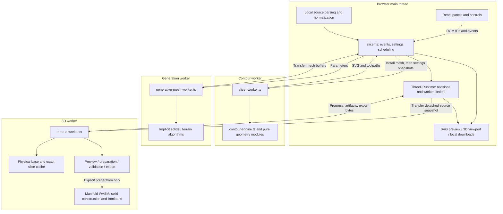
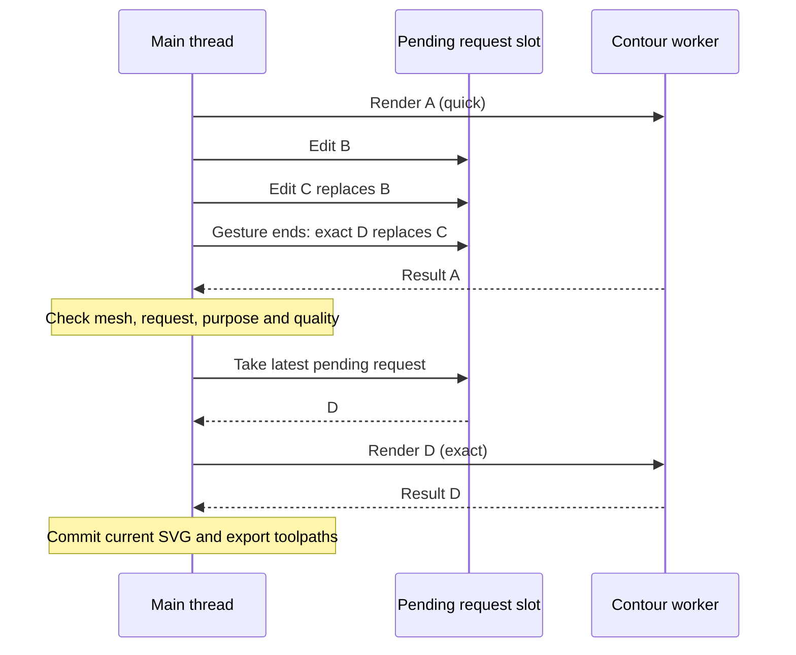
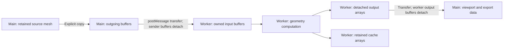
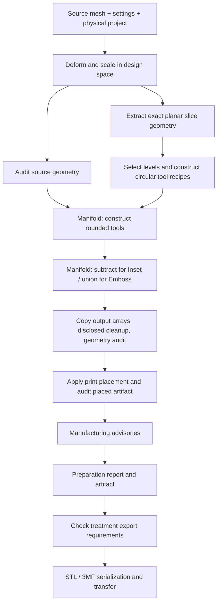
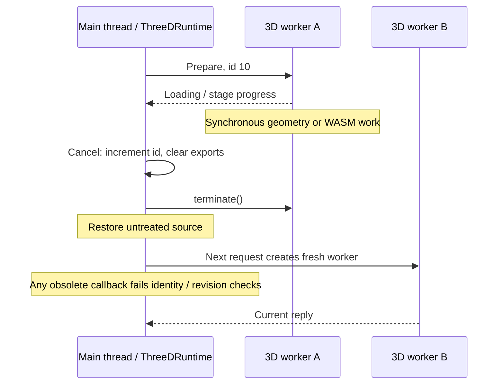

# Web Workers and WASM in Slicewise: architecture for a talk

Slicewise turns local meshes and SVG artwork into contour drawings, plotter paths, and experimental 3D treatments. Its architecture illustrates two distinct decisions: **where computation runs** (Web Workers) and **which implementation performs it** (TypeScript algorithms or a WASM geometry kernel).

Source baseline: inspected on 9 September 2026 at commit `758fe37`. References below point to the maintained `src/` application, not the historical `slicewise.html`. Code blocks are verbatim excerpts with common indentation removed; some show part of a surrounding function. Line numbers describe this baseline and will drift as code changes. See also [the general architecture guide](./ARCHITECTURE.md), [parameters](./PARAMETERS.md), and [test conventions](./TESTING.md).

## 1. Which technologies are actually used?

| Technology     | Use in this project                                                                                                                                                    | Evidence                                                                                                                                                                                                                             |
| -------------- | ---------------------------------------------------------------------------------------------------------------------------------------------------------------------- | ------------------------------------------------------------------------------------------------------------------------------------------------------------------------------------------------------------------------------------ |
| Web Workers    | Dedicated module workers for contours, source generation, and 3D preview/preparation; an additional worker belongs to the separate feasibility page.                   | [slicer.ts:601](../src/lib/slicer.ts#L601), [slicer.ts:1196](../src/lib/slicer.ts#L1196), [three-d-runtime.ts:24](../src/lib/three-d-runtime.ts#L24), [three-d-feasibility-worker.ts:1](../src/lib/three-d-feasibility-worker.ts#L1) |
| WebAssembly    | The pinned `manifold-3d` 3.5.3 dependency supplies the solid geometry kernel. The production 3D worker loads its JS wrapper and `.wasm` asset on explicit preparation. | [package.json:27](../package.json#L27), [three-d-worker.ts:15](../src/lib/three-d-worker.ts#L15)                                                                                                                                     |
| AssemblyScript | No application implementation or compiler configuration found. The repository does not compile its `.ts` geometry files into WASM.                                     | [package.json:6](../package.json#L6), [tsconfig.json:2](../tsconfig.json#L2), [vite.config.ts:5](../vite.config.ts#L5)                                                                                                               |

For the AssemblyScript portion of a wider talk, describe it as another possible way to author a WASM module, not as Slicewise's implementation. AssemblyScript is a TypeScript-like language with its own compiler and constraints; TypeScript syntax alone does not imply WASM. See the official [AssemblyScript concepts](https://www.assemblyscript.org/concepts.html) and [compiler guide](https://www.assemblyscript.org/compiler.html).

**Speaker point:** a worker can run ordinary JavaScript. WASM does not itself establish a background execution boundary. Here, the worker provides isolation from UI execution, and Manifold provides solid operations behind a JavaScript API. There is no application-level `SharedArrayBuffer`, `Atomics`, or worker-pool protocol in the inspected source; do not describe this as one Boolean distributed across all CPU cores.

## 2. System map: UI ownership and computation ownership



React owns interface structure; `slicer.ts` binds stable control IDs and owns browser orchestration. Geometry code receives data rather than reaching into the DOM. Workers cannot directly manipulate the document; messages return results for the main thread to display. See [MDN's worker execution model](https://developer.mozilla.org/en-US/docs/Web/API/Web_Workers_API/Using_web_workers), [slicer.ts:750](../src/lib/slicer.ts#L750), and [contour-engine.ts:3497](../src/lib/contour-engine.ts#L3497).

**Problem solved:** triangle slicing, visibility, implicit-surface generation, and Boolean operations can monopolize an execution thread. Separating these tasks lets the main thread continue processing controls and displaying progress. The separation also lets geometry tests call algorithms without constructing a browser UI.

**Limit:** this does not move every cost off the main thread. Source installation, defensive copies, settings snapshots, SVG application, and viewport rendering still cost time. There is no measured universal speedup implied by this architecture.

## 3. Worker inventory and message contracts

| Entry point                                                                    | Lifetime / initialization                                                                           | Request and response                                                                                                                        | Computational role                                                             |
| ------------------------------------------------------------------------------ | --------------------------------------------------------------------------------------------------- | ------------------------------------------------------------------------------------------------------------------------------------------- | ------------------------------------------------------------------------------ |
| [slicer-worker.ts:1](../src/lib/slicer-worker.ts#L1)                           | Created by page runtime; retains the installed mesh.                                                | `mesh` installs buffers; `render` carries `id`, `meshVersion`, `settings`, `quick`; reply is `result` or `error`.                           | TypeScript contour engine, projection, visibility, styling, SVG and toolpaths. |
| [generative-mesh-worker.ts:1](../src/lib/generative-mesh-worker.ts#L1)         | Created by page runtime independently of contour worker.                                            | `generate` carries `id`, source discriminator and parameters; reply carries transferred positions/normals/indices and statistics, or error. | TypeScript implicit solids and terrain generation.                             |
| [three-d-worker.ts:1](../src/lib/three-d-worker.ts#L1)                         | Created on demand by `ThreeDRuntime`; terminated on exit, cancellation, or interrupted preparation. | Typed `ThreeDRequest` / `ThreeDReply`: IDs, source revision, project/settings, optional progress, artifacts, preparation report and files.  | TypeScript preview and audits; lazy WASM for preparation.                      |
| [three-d-feasibility-worker.ts:1](../src/lib/three-d-feasibility-worker.ts#L1) | Separate developer trial; initializes WASM when that worker loads.                                  | Trial ID, repetitions and suite; result rows or error.                                                                                      | Repeated geometry fixtures and diagnostics, independent of normal drawing.     |

The 3D protocol is declared at [three-d-project.ts:49](../src/lib/three-d-project.ts#L49) and [three-d-project.ts:77](../src/lib/three-d-project.ts#L77). This is a small set of purpose-specific workers, not an interchangeable pool or Service Worker architecture.

### Example: Vite recognizes the worker entry point

Source: [src/lib/three-d-runtime.ts:22](../src/lib/three-d-runtime.ts#L22), lines 22–26.

```ts
constructor(
  private publish: (state: ThreeDUiState) => void,
  private createWorker = () =>
    new Worker(new URL('./three-d-worker.ts', import.meta.url), { type: 'module' }),
) {}
```

The URL is relative to its importing module; `{ type: 'module' }` permits the worker's module imports. The runtime supplies a replaceable worker factory, which also gives tests a seam for controlled fake replies. Vite's project configuration is at [vite.config.ts:5](../vite.config.ts#L5).

### Example: a TypeScript worker needs no WASM

Source: [src/lib/slicer-worker.ts:25](../src/lib/slicer-worker.ts#L25), lines 25–37.

```ts
  try {
    const result = computeContours(mesh, data.settings, data.quick);
    self.postMessage({ type: 'result', id: data.id, meshVersion: data.meshVersion, result });
  } catch (error) {
    self.postMessage({
      type: 'error',
      id: data.id,
      meshVersion: data.meshVersion,
      message: error instanceof Error ? error.message : 'Contour rendering failed',
    });
  }
});
```

The mesh was installed by the earlier `mesh` message ([slicer-worker.ts:6](../src/lib/slicer-worker.ts#L6)). Subsequent camera or styling edits send settings, not another complete mesh. `computeContours` is synchronous within this worker, and normal result messages have no transfer list: SVG strings and result objects use structured cloning.

**Problem solved:** worker plumbing stays thin, while the substantial algorithm remains callable from tests. Error strings cross the boundary explicitly; a thrown exception cannot be caught by a `try` around the main thread's earlier `postMessage` call.

## 4. Drawing responsiveness: bounded scheduling and exact results

Moving work to a worker is insufficient if every pointer event adds another expensive job. The drawing runtime keeps one request in flight and one coalesced pending request. Its scheduling preserves pending exact quality when appropriate, throttles quick previews, and dispatches through a timer or animation frame. See [slicer.ts:750](../src/lib/slicer.ts#L750) and [render-scheduling.ts:54](../src/lib/render-scheduling.ts#L54).

Source: [src/lib/slicer.ts:750](../src/lib/slicer.ts#L750), lines 750–767.

```ts
function dispatchRender(): void {
  if (renderInFlight || !queuedRender) return;
  const request = queuedRender;
  queuedRender = null;
  activeRender = request;
  renderInFlight = true;
  lastDispatch = performance.now();
  request.dispatchedAt = lastDispatch;
  recordMeasure('slicewise:render:queue', request.queuedAt, lastDispatch);
  syncPreviewBusy();
  renderWorker.postMessage({
    type: 'render',
    id: request.id,
    meshVersion: request.meshVersion,
    quick: request.quality === 'quick',
    settings: request.settings,
  });
}
```



The result policy distinguishes preview, commit, capture, and discard. A same-mesh stale quick result can be shown during active dragging to maintain feedback; stale exact results do not replace current export state. Animation export results are captured separately. The policy is explicit in [render-scheduling.ts:76](../src/lib/render-scheduling.ts#L76), applied at [slicer.ts:864](../src/lib/slicer.ts#L864).

Quick computation reduces work—for example, visibility-buffer resolution is `quick ? 320 : 1100` at [contour-engine.ts:2815](../src/lib/contour-engine.ts#L2815). The exact/preview distinction extends beyond resolution: quick output is provisional, and the current exact render supplies authoritative export data. See [ARCHITECTURE.md, rendering and concurrency](./ARCHITECTURE.md#rendering-and-concurrency).

**Problems solved:** bounded backlog, less time spent on intermediate slider values, and no accidental export of a coarse or obsolete drawing. Request IDs alone would not save wasted computation; coalescing alone would not prevent stale output from being displayed. Both are needed.

Generation uses its own pending slot and IDs ([slicer.ts:1247](../src/lib/slicer.ts#L1247)). `cancelGeneration()` invalidates the result and clears queued work; it does **not** terminate an already running generation worker ([slicer.ts:1227](../src/lib/slicer.ts#L1227)). This differs from hard cancellation of 3D preparation.

## 5. Buffer ownership: transfer is a design decision

The shared mesh convention is flat typed arrays: `V` contains XYZ positions, `T` contains triangle vertex indices, and `N` contains normals. The main thread keeps source data for future drawing and 3D requests.

Source: [src/lib/three-d-runtime.ts:145](../src/lib/three-d-runtime.ts#L145), lines 145–157.

```ts
#dispatch(): void {
  if (this.#busy || !this.#queued || !this.#worker) return;
  const request = this.#queued;
  this.#queued = null;
  const mesh = request.source.mesh;
  const V = Float32Array.from(mesh.V),
    T = Uint32Array.from(mesh.T),
    N = Float32Array.from(mesh.N ?? []);
  this.#busy = true;
  this.#worker.postMessage(
    { ...request, source: { ...request.source, mesh: { ...mesh, V, T, N } } },
    [V.buffer, T.buffer, N.buffer],
  );
```

`Float32Array.from` and `Uint32Array.from` allocate copies first. The transfer list then moves those copies' backing buffers to the worker, detaching them from the sender. The original source remains usable. Typed-array transfer operates on the `ArrayBuffer`, not the typed-array object itself. See [MDN's transferable objects documentation](https://developer.mozilla.org/en-US/docs/Web/API/Web_Workers_API/Transferable_objects).



**Problem solved:** bulk messaging avoids an additional structured-clone copy of transferred buffers while preserving source ownership. This is not an end-to-end zero-copy pipeline: initial copies, kernel imports, kernel output copies, and main-thread download copies are intentional.

Drawing source installation follows the same copy-then-transfer pattern, but only when installing a mesh ([slicer.ts:925](../src/lib/slicer.ts#L925)). The 3D runtime currently sends a detached source mesh for each dispatched request. Its worker cache saves downstream computation, not that input-copy cost.

Generation can transfer newly created arrays immediately because it does not retain that generated output:

Source: [src/lib/generative-mesh-worker.ts:20](../src/lib/generative-mesh-worker.ts#L20), lines 20–26.

```ts
const positions = mesh.positions.buffer;
const normals = mesh.normals.buffer;
const indices = mesh.indices.buffer;
self.postMessage(
  { type: 'result', id: event.data.id, positions, normals, indices, stats: mesh.stats },
  { transfer: [positions, normals, indices] },
);
```

The 3D reply uses a `Set<ArrayBuffer>` before transferring ([three-d-worker.ts:44](../src/lib/three-d-worker.ts#L44)). In an untreated preview, `artifact` and `sourceArtifact` can reference the same object; deduplication avoids listing the same buffer twice. Cached base/slice data must remain separate from transferred output. A regression actually detaches reply buffers and then reuses the cache at [three-d-preparation.test.ts:202](../src/lib/three-d-preparation.test.ts#L202).

## 6. Lazy WASM: load the kernel at the feature boundary

Source: [src/lib/three-d-worker.ts:15](../src/lib/three-d-worker.ts#L15), lines 15–36.

```ts
if (request.purpose === 'prepare') {
  self.postMessage({
    id,
    sourceVersion: source.version,
    progress: 'Loading the local geometry kernel…',
  } satisfies ThreeDReply);
  kernelModule ??= Promise.all([
    import('manifold-3d'),
    import('manifold-3d/manifold.wasm?url'),
  ]).then(async ([{ default: Module }, { default: wasmUrl }]) => {
    const module = await Module({ locateFile: () => wasmUrl });
    module.setup();
    return module;
  });
  reply = prepareThreeD(
    request,
    await kernelModule,
    (progress) =>
      self.postMessage({ id, sourceVersion: source.version, progress } satisfies ThreeDReply),
    geometryCache,
  );
} else reply = previewThreeD(request, geometryCache).reply;
```

There are two imports: the package's JavaScript wrapper and a Vite `?url` import for the local WASM asset. `locateFile` directs module initialization to that asset; `setup()` initializes the exposed API. The cached promise avoids repeating initialization within the worker's lifetime. The worker's outer error handler resets the promise on an escaping failure ([three-d-worker.ts:57](../src/lib/three-d-worker.ts#L57)); normal rejected preparation reports are returned as data.

**Problems solved:** opening the drawing workspace or requesting an untreated 3D preview does not initialize the geometry kernel. The WASM asset ships with the application rather than requiring a CDN. Source geometry remains local; fetching application code is distinct from uploading a model.

**Tradeoff:** the first Prepare action includes loading and initialization latency. Terminating the worker loses the initialized module and its cache, so a fresh worker must initialize again, although the browser may already have the asset cached.

An `async` message handler does not make `prepareThreeD` asynchronous or preemptible: only module loading is awaited here. The runtime's one-in-flight discipline prevents normal requests from overlapping while initialization is pending.

## 7. The 3D computation path: geometry, kernel, audits, files



`previewThreeD` constructs the physical source and overlays without calling Manifold ([three-d-preparation.ts:18](../src/lib/three-d-preparation.ts#L18)). Preparation reuses that base and exact slice geometry, validates size/selection, checks the source, builds tools, applies the treatment, places the result, and screens it ([three-d-preparation.ts:46](../src/lib/three-d-preparation.ts#L46)).

The kernel adapter uses Z-up millimeter buffers ([solid-kernel.ts:10](../src/lib/solid-kernel.ts#L10)). For rounded tools, it takes hulls of identically oriented endpoint spheres and unions capsule segments in batches of eight ([solid-kernel.ts:143](../src/lib/solid-kernel.ts#L143)). These are physical mesh operations, distinct from drawing projected SVG paths.

### Example: the JS-to-WASM operation boundary

Source: [src/lib/solid-kernel.ts:266](../src/lib/solid-kernel.ts#L266), lines 266–273.

```ts
result = own(operation === 'inset' ? source.subtract(combined!) : source.add(combined!));
const measurements = inspect(result);
const output = result.getMesh();
// No property seams are introduced: the adapter imports XYZ only.
const mesh = { V: output.vertProperties.slice(), T: output.triVerts.slice() };
checkMesh(mesh);
const cleaned = clean(mesh, 'Result');
const topology = assertPrintTopology(cleaned, 'Result');
```

**Problem solved:** the application reuses Manifold's solid API instead of implementing solid union/difference in its contour engine. The adapter contains the package dependency, native object ownership, geometry checks and conversion costs.

A native operation succeeding does not prove the final serialized mesh is suitable for printing. Independent audits inspect the actual arrays, including topology, intersections and shell containment. Placement triggers another geometry check through manufacturing screening. Cleanup and optional approximation are reported rather than silently equated with the exact source.

Treatment export requires accepted preparation, one physical body, and all eight required geometry checks at [three-d-export.ts:5](../src/lib/three-d-export.ts#L5). There is a distinct **untreated export** path after physical size confirmation; it intentionally does not claim treatment audits. Serialization of STL and 3MF is attempted independently so one format's error can leave the other available ([three-d-export.ts:46](../src/lib/three-d-export.ts#L46)). Manufacturing advisories are not a guarantee of print readiness.

## 8. Native lifetime and bounded caches

JavaScript wrappers do not remove the need to release Manifold objects. The package explicitly requires `delete()` for its native geometry objects; see [Manifold memory management](https://manifoldcad.org/docs/jsapi/documents/Using_Manifold.html).

Source: [src/lib/solid-kernel.ts:62](../src/lib/solid-kernel.ts#L62), lines 62–73.

```ts
let liveHandles = 0;
const own = (solid: Manifold) => {
  liveHandles++;
  return solid;
};
const release = (solid: Manifold) => {
  try {
    solid.delete();
  } finally {
    liveHandles--;
  }
};
```

The operation releases its owned solids even when inspection or output auditing throws:

Source: [src/lib/solid-kernel.ts:284](../src/lib/solid-kernel.ts#L284), lines 284–288.

```ts
} finally {
  if (result) release(result);
  if (combined) release(combined);
  if (source) release(source);
}
```

**Problem solved:** repeated preparations and rejected models do not accumulate adapter-owned solids. `liveHandles` measures ownership for tests, not WASM heap size or browser memory reclamation. Cleanup code also covers intermediate spheres, translated endpoints, hulls, batches and decomposed boundary components.

The 3D worker retains one physical base and one exact slice set, with a default 64 MiB retention budget ([three-d-cache.ts:24](../src/lib/three-d-cache.ts#L24)). Base identity includes source metadata, Object settings and size, plus exact comparisons of source arrays. Slice identity includes the field and revision. Placement and selected-level changes can reuse upstream geometry; source, deformation, sizing or field changes invalidate the relevant stage.

No native handles or validation reports are cached there. If a result exceeds retention capacity, computation still runs without retaining it ([three-d-cache.ts:58](../src/lib/three-d-cache.ts#L58)). Contour rendering has separate mesh-keyed caches, including the `WeakMap` at [contour-engine.ts:638](../src/lib/contour-engine.ts#L638).

**Tradeoff:** caches consume memory and require exact invalidation rules. The kernel's 500,000-triangle, 64-tool and 64 MiB input-buffer bounds ([solid-kernel.ts:21](../src/lib/solid-kernel.ts#L21)) do not bound peak native Boolean memory. Cache retention and algorithm work limits solve different problems.

## 9. Cancellation and stale replies are separate concerns

Source: [src/lib/three-d-runtime.ts:73](../src/lib/three-d-runtime.ts#L73), lines 73–87.

```ts
worker.addEventListener('message', (event: MessageEvent<ThreeDReply>) => {
  if (worker !== this.#worker) return;
  const reply = event.data;
  if (reply.progress) {
    if (reply.id === this.#id && reply.sourceVersion === this.#sourceVersion) {
      this.state = {
        ...this.state,
        preparation: { status: 'pending', message: reply.progress },
      };
      this.publish(this.state);
    }
    return;
  }
  this.#busy = false;
  if (reply.id === this.#id && reply.sourceVersion === this.#sourceVersion) {
```

The runtime checks worker identity, request ID and source revision. Progress updates keep preparation pending and do not free the in-flight slot. Final replies dispatch the next queued edit. A result that belongs to an older source or revision must not re-enable export.



Cancellation calls `#terminate()` at [three-d-runtime.ts:172](../src/lib/three-d-runtime.ts#L172):

Source: [src/lib/three-d-runtime.ts:199](../src/lib/three-d-runtime.ts#L199), lines 199–207.

```ts
#terminate(): void {
  this.#stl = null;
  this.#threeMf = null;
  this.#preparing = false;
  this.#worker?.terminate();
  this.#worker = null;
  this.#busy = false;
  this.#queued = null;
}
```

**Problem solved:** a synchronous native call cannot service a queued “cancel” message while occupying the worker's execution thread. The main thread can terminate the whole worker. `terminate()` stops it without an opportunity to finish cleanup; this differs from normal success/error paths that execute `finally`. See [MDN's termination semantics](https://developer.mozilla.org/en-US/docs/Web/API/Worker/terminate).

New edits interrupt active preparation, and leaving 3D also stops the worker. This gives users a way out of expensive work, at the cost of losing worker-local caches and kernel initialization. Stage progress is useful feedback, not a continuously updated percentage or a cooperative cancellation checkpoint inside a Boolean.

## 10. What to demonstrate and what to measure

Suggested 25–30 minute talk flow:

| Segment   | Demonstration / code                                                                             | Architectural lesson                                                                                     |
| --------- | ------------------------------------------------------------------------------------------------ | -------------------------------------------------------------------------------------------------------- |
| 3 minutes | Technology inventory and system diagram.                                                         | Workers choose execution context; WASM supplies a compute implementation; AssemblyScript is absent here. |
| 5 minutes | Orbit a detailed drawing, then release the pointer. Show `dispatchRender` and result policy.     | Keep feedback responsive and commit exact results separately; coalesce obsolete edits.                   |
| 4 minutes | Show copy-then-transfer and generation's direct transfer.                                        | Buffer ownership and retained data determine where copying is necessary.                                 |
| 5 minutes | Enter 3D, inspect an untreated model, then Prepare. Show lazy imports and the subtract/add line. | Feature-scoped initialization and a narrow native boundary.                                              |
| 4 minutes | Cancel during preparation, edit, then prepare again.                                             | Hard cancellation, fresh worker lifecycle and stale-reply protection.                                    |
| 4 minutes | Show audits, native `finally`, cache rules and tests.                                            | Responsiveness, memory ownership and geometric correctness require separate mechanisms.                  |

For the 3D demo, rehearse the rounded cube with eight exact slices and confirmed sizing; the feasibility record contains accepted examples and limits. Use the current supported planar fields and treatment controls described in [PARAMETERS.md](./PARAMETERS.md#3d-workspace-internal-prototype). Larger exact workloads may reject at budgets or geometry audits; such a rejection is an intentional observable outcome, not proof that WASM failed to load. See [THREE_D_FEASIBILITY.md](./THREE_D_FEASIBILITY.md).

To inspect the implementation locally:

```bash
npm run dev
npm test -- src/lib/render-scheduling.test.ts src/lib/three-d-runtime.test.ts
npm test -- src/lib/solid-kernel.test.ts src/lib/three-d-preparation.test.ts --testTimeout=30000
npm run build
npm run build:3d
npm run bench:3d -- 3 contours
```

These are rehearsal/verification commands, not a claim that benchmarks were run for this document. The normal build covers the application graph; `build:3d` builds the separate developer trial. Dependencies must already be installed.

Use the browser's worker debugger and Network panel to distinguish worker JavaScript, lazy wrapper chunks, and the local `.wasm` request. Compare cold and warm Prepare runs separately. Record source triangle count, slice count, tool precision, treatment, browser and machine when reporting timings.

Drawing instrumentation records queue time, worker round trip, DOM application and end-to-paint time ([slicer.ts:758](../src/lib/slicer.ts#L758), [slicer.ts:843](../src/lib/slicer.ts#L843), [slicer.ts:884](../src/lib/slicer.ts#L884)). Worker round trip includes messaging overhead; algorithm time alone cannot establish perceived responsiveness. Benchmark complete accepted preparations separately from quick budget rejections. Do not claim “WASM is N times faster” without an equivalent implementation and workload comparison.

## 11. Evidence to keep beside the slides

| Claim                                                                                                              | Existing regression boundary                                                                                                       |
| ------------------------------------------------------------------------------------------------------------------ | ---------------------------------------------------------------------------------------------------------------------------------- |
| Quick, exact and stale drawing replies have different dispositions.                                                | [render-scheduling.test.ts:1](../src/lib/render-scheduling.test.ts#L1)                                                             |
| Edits coalesce; stale sources and post-exit replies do not update UI; workers restart after errors.                | [three-d-runtime.test.ts:23](../src/lib/three-d-runtime.test.ts#L23)                                                               |
| Progress remains pending; cancellation terminates native work's worker; later edits invalidate prepared artifacts. | [three-d-runtime.test.ts:66](../src/lib/three-d-runtime.test.ts#L66)                                                               |
| Transferring a reply does not detach retained cache data.                                                          | [three-d-preparation.test.ts:202](../src/lib/three-d-preparation.test.ts#L202)                                                     |
| Small retention budgets fall back to uncached computation.                                                         | [three-d-preparation.test.ts:271](../src/lib/three-d-preparation.test.ts#L271)                                                     |
| Native handles are released on failure and repeated success.                                                       | [solid-kernel.test.ts:143](../src/lib/solid-kernel.test.ts#L143), [solid-kernel.test.ts:173](../src/lib/solid-kernel.test.ts#L173) |
| Untreated file downloads are detached and revision-associated.                                                     | [three-d-runtime.test.ts:157](../src/lib/three-d-runtime.test.ts#L157)                                                             |

Fake-worker runtime tests prove scheduling and state transitions; they cannot prove real-browser cancellation latency, loading behavior, or long-session native memory use. Real-kernel tests exercise geometry but cannot establish physical print quality. Use the manual workflows and recorded limitations in [TESTING.md](./TESTING.md) when deciding which claims to make on stage.
